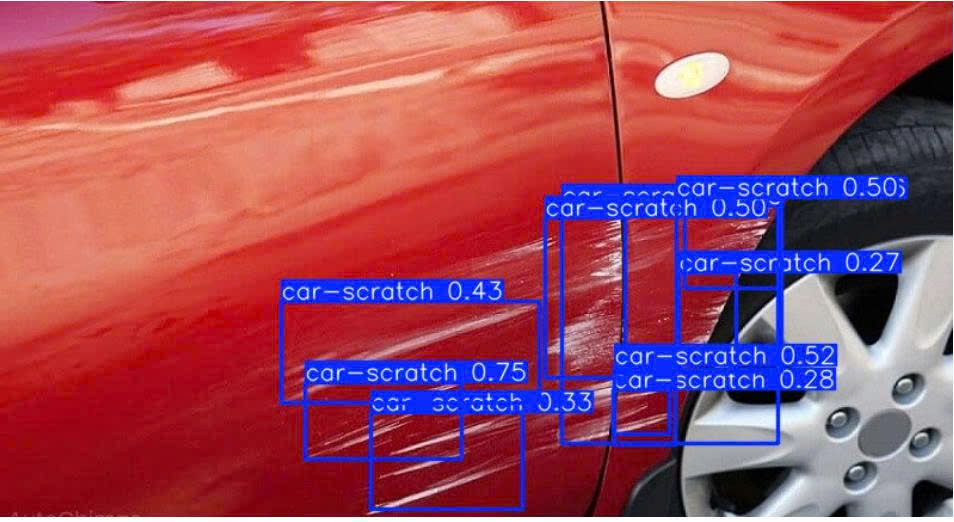

# 🚗 Car Scratch Detection using YOLOv8 (Nhận diện vết xước vỏ ô tô)

## 💡 Lý do thực hiện dự án
Dự án này xuất phát từ quá trình quan sát thực tế quy trình dịch vụ ô tô. Trước khi đưa xe vào phòng sơn để xử lý, việc đánh giá bề mặt vỏ xe, khoanh vùng các vết xước hoặc vết móp thường phải được tiến hành thủ công bằng mắt thường. Khâu này tốn khá nhiều thời gian và phụ thuộc lớn vào kinh nghiệm của thợ kỹ thuật. 

Vì vậy, mình xây dựng dự án này nhằm ứng dụng Computer Vision (Thị giác máy tính) để tự động hóa việc nhận diện vết xước vỏ xe, hỗ trợ quy trình đánh giá hư hại diễn ra nhanh chóng và khách quan hơn.

## 🛠️ Công nghệ sử dụng
* **Ngôn ngữ:** Python
* **Mô hình AI:** YOLOv8 (Ultralytics)
* **Môi trường huấn luyện:** Google Colab (GPU T4)
* **Dataset:** Car Scratch Dataset (Roboflow)

## 📊 Kết quả dự đoán thực tế (Demo)
*Mô hình đã nhận diện chính xác các vết xước và đưa ra độ tự tin (Confidence Score).*

## 📂 Hướng dẫn xem dự án
1. File `Car_Scratch_Detection.ipynb`: Chứa toàn bộ mã nguồn quá trình tải dữ liệu, huấn luyện (train) và dự đoán (predict).
2. File `best.pt`: File trọng số (Weights) tốt nhất của mô hình sau khi huấn luyện xong.
